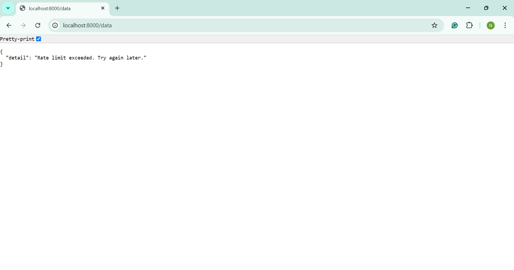

# Rate Limiting API

This project is a FastAPI application that implements a rate-limiting mechanism using Redis. Clients are restricted to 5 requests per minute, based on their IP address.

## Table of Contents
- [Features](#features)
- [Getting Started](#getting-started)
  - [Prerequisites](#prerequisites)
  - [Installation](#installation)
- [Running the Application](#running-the-application)
- [API Endpoints](#api-endpoints)
- [Screenshots](#screenshots)
- [License](#license)

## Features

- **Rate Limiting**: Limits the number of requests per IP address.
- **FastAPI**: Fast and asynchronous API framework.
- **Redis**: Backend for managing rate limits.
- **Dockerized**: Easily start the app and Redis using Docker.

## Getting Started

### Prerequisites

- Python 3.7 or higher
- Redis (cloud-hosted or local)
- FastAPI
- Docker 
- Redis Python library

### Installation

1. Clone the repository:
   ```bash
   git clone https://github.com/Nourin-nnn/rate-limiting-api.git
   cd rate-limiting-api
   ```
2. Create the Virtual Environment:

```bash
python -m venv venv
```

This command creates a directory named venv in the project folder, which will contain the necessary files for the virtual environment.

3. Activate the Virtual Environment:

For Git Bash (MINGW64) on Windows:

```bash
source venv/Scripts/activate
```
For Command Prompt (CMD) on Windows:

```bash
venv\Scripts\activate
```
For PowerShell on Windows:

```bash
.\venv\Scripts\Activate
```
For macOS or Linux:

```bash
source venv/bin/activate
```
After activation, terminal prompt will change to show the virtual environment's name, indicating that we are now working inside it.

4. Install the required packages:

```bash
pip install fastapi redis uvicorn
```

5. Set Up Redis: Install Redis locally or set it up using Docker (recommended for ease of use):
```bash
docker run --name redis -p 6379:6379 -d redis
```
6. Update the main.py file with your Redis connection details:

```python
# Initialize Redis client with cloud-hosted settings
redis_client = redis.StrictRedis(
    host='Cloud Redis host', 
    port=Cloud Redis port,                                                            
    password='Replace with your actual password',                                
    decode_responses=True
)
```
## Running the Application
To run the FastAPI application, use:

```bash
uvicorn main:app --reload
```
The API will be accessible at http://127.0.0.1:8000/


## API Endpoints

GET /data: Fetches data and checks the rate limit for the IP address.
GET /: Welcome message.

## Screenshots

- Welcome Message Example 
- API Response Example 
- Rate Limit Exceeded Example 

## License

This project does not have a specific license. Feel free to use and modify it as you wish.


### Instructions to Update the README

1. **Replace** the `path/to/your/screenshotX.png` with the actual paths to your screenshot files.
2. Make sure to provide any necessary instructions regarding the Redis configuration.


